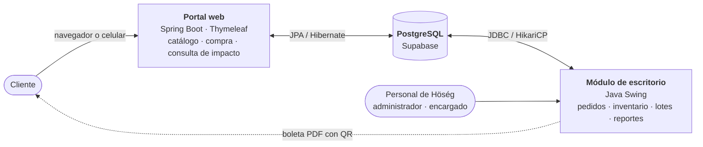
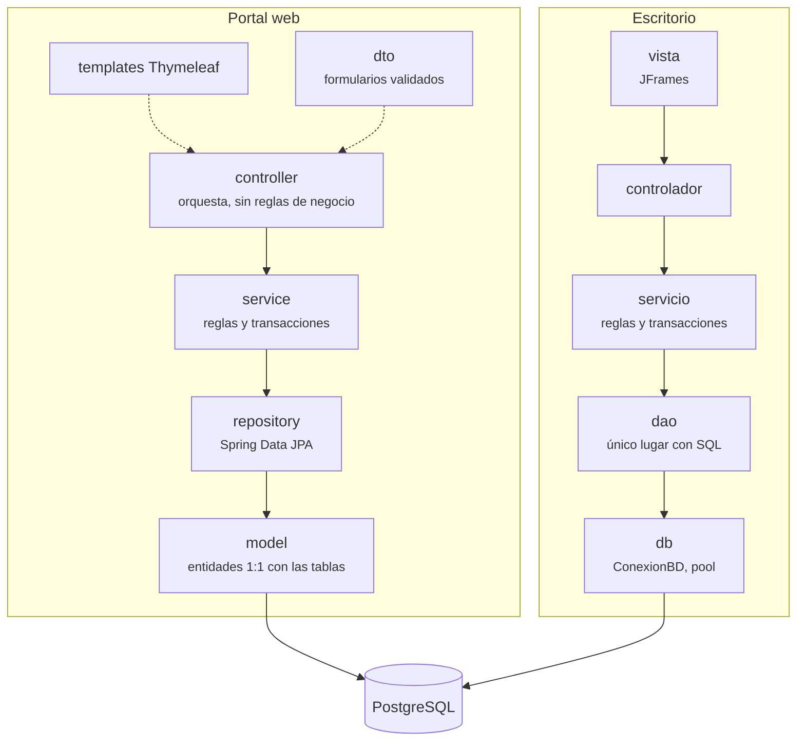
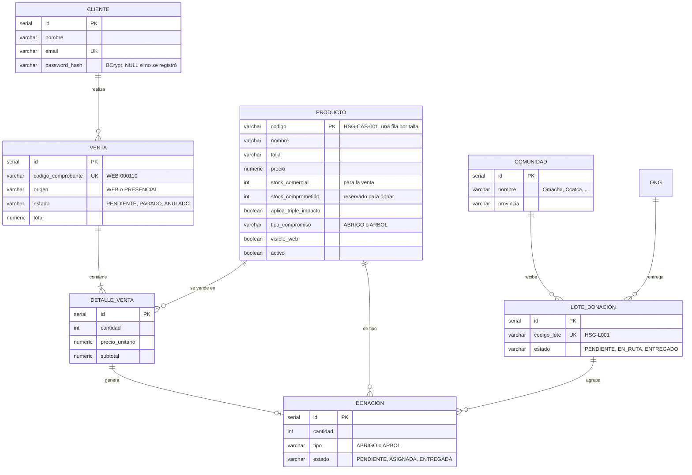
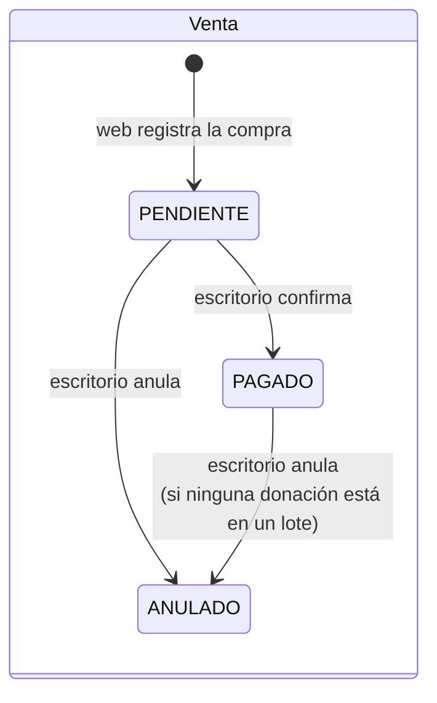
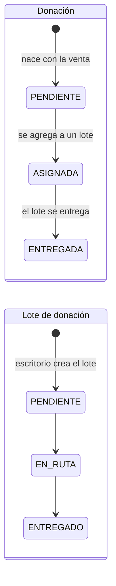
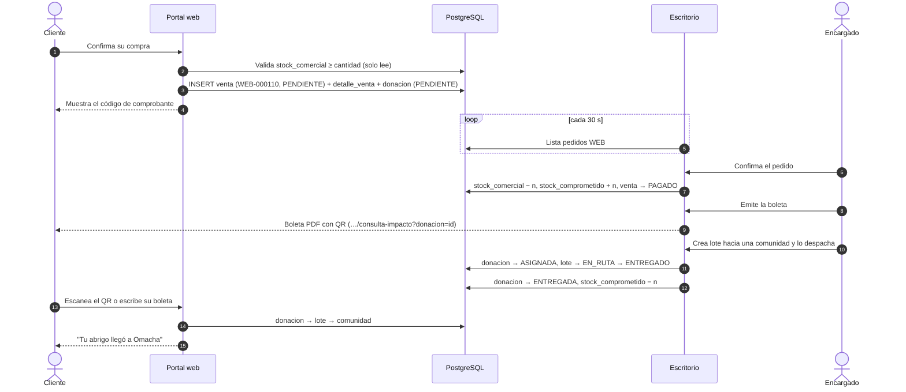

# Arquitectura del sistema HÖSÉG

Cómo se integran el **portal web** (este repositorio) y el **módulo de escritorio SEGITD-HÖSÉG** (repositorio [`Arukxyz/Hoseg_Store`](https://github.com/Arukxyz/Hoseg_Store)): qué hace cada uno, qué datos comparten y qué reglas evitan que se pisen.

> Los diagramas están en [Mermaid](https://mermaid.js.org/): GitHub los dibuja al abrir este archivo. En VS Code se ven con la extensión *Markdown Preview Mermaid Support*.

## 1. Visión general

Dos aplicaciones independientes, sin API entre ellas: **se comunican a través de la base de datos**. La web registra lo que hace el cliente; el escritorio lo procesa y lo lleva hasta la comunidad beneficiada.

## 2. Componentes y tecnologías

| | Portal web | Módulo de escritorio |
|---|---|---|
| Usuarios | Clientes (público) | Personal interno con rol ADMINISTRADOR o ENCARGADO |
| Lenguaje | Java 21 | Java 25 |
| Framework | Spring Boot 3.4: Web, Data JPA, Validation, Security | Swing con tema FlatLaf |
| Vistas | Thymeleaf + Bootstrap 5 | JFrames |
| Acceso a datos | Spring Data JPA (Hibernate), `ddl-auto=validate` | JDBC con pool HikariCP |
| Archivos que genera | — | Excel (Apache POI), PDF y QR (PDFBox + ZXing), respaldos CSV |
| Contraseñas | Clientes: BCrypt | Personal: SHA-256 con salt |
| Base de datos | PostgreSQL en Supabase, **la misma para ambos**, por el *Session pooler* (puerto 5432) | ← |
| Dueño del esquema | No; solo valida | **Sí**: scripts `01`..`06` en `src/main/resources/sql/` |

## 3. Arquitectura en capas

Ambos sistemas siguen la misma disciplina: cada capa solo habla con la de abajo, las reglas de negocio viven en la capa de servicio y el SQL solo existe en la capa de datos.

**Paquetes del portal web** (`pe.edu.utp.hoseg.web`):

| Paquete | Contenido actual |
|---|---|
| `config` | `SecurityConfig` (rutas públicas y protegidas, BCrypt), `WebConfig` (locale es-PE) |
| `model` | `Producto`, `Cliente`, `Venta`, `DetalleVenta`, `Donacion`, `LoteDonacion`, `Comunidad`, `Ong` y los enums de estado |
| `repository` | Un repositorio por entidad consultada |
| `service` | `CatalogoService` (tarjetas agrupadas por talla), `ImpactoService` (cifras públicas), `CarritoService` (carrito en sesión) |
| `dto` | `TarjetaProducto`, `ResumenImpacto`, `ItemCarrito` |
| `controller` | `HomeController`, `AtributosGlobales` (datos comunes a todas las vistas), `EjemploController` (solo en desarrollo) |

## 4. Base de datos compartida

### 4.1 Modelo de datos

Tablas que usa el flujo de venta y donación (el esquema completo, con `usuario`, `proveedor`, `pedido_proveedor` y `movimiento_inventario`, está en `01_schema.sql` del escritorio).

Detalles del modelo que conviene tener presentes:

- **Cada talla es un producto distinto** (`HSG-CAS-001` = M, `HSG-CAS-002` = L, mismo `nombre`). La web los agrupa por nombre para mostrar una sola tarjeta con sus tallas.
- La **donación nace de una línea de venta** (`id_detalle_venta`) y termina en un lote. Es la tabla que responde a la pregunta del proyecto: *qué venta generó qué donación y a qué comunidad llegó*.
- Solo generan donación los productos con `aplica_triple_impacto = true` y `tipo_compromiso` definido.

### 4.2 Quién escribe cada tabla

| Tabla | Portal web | Escritorio |
|---|---|---|
| `producto` | Lee (catálogo). **Nunca modifica el stock** | Crea, edita, da de baja y mueve el stock |
| `cliente` | Crea y actualiza (registro) | Lee |
| `venta`, `detalle_venta` | **Crea** pedidos `origen='WEB'`, `estado='PENDIENTE'` | Confirma (`PAGADO`) o anula |
| `donacion` | Crea en `PENDIENTE` al comprar | Asigna a un lote y marca como entregada |
| `lote_donacion`, `comunidad`, `ong` | Lee (consulta de impacto y cifras) | Crea y gestiona |
| `movimiento_inventario` | No usa | Registra cada movimiento de stock |
| `usuario`, `proveedor`, `pedido_proveedor` | No usa | Gestiona |

## 5. Ciclo de vida de un pedido

### 5.1 Estados

### 5.2 De la compra a la comunidad

## 6. Reglas de integración

Son las que evitan que un sistema corrompa los datos del otro.

1. **El esquema tiene un solo dueño: el escritorio.** La web usa `spring.jpa.hibernate.ddl-auto=validate`: Hibernate comprueba al arrancar que las entidades coinciden con las tablas y, si no, la aplicación no inicia. Nunca `update` ni `create`, que crearían tablas paralelas. Un cambio de esquema es un script SQL nuevo, numerado e idempotente, en el repositorio del escritorio.
2. **El stock lo mueve solo el escritorio.** La web valida que haya stock antes de registrar la venta, pero no lo descuenta. Si lo hiciera, el stock bajaría dos veces: al comprar y al confirmar.
3. **La aritmética la hace la base de datos.** Nada de leer un valor, calcular en Java y escribirlo, porque dos usuarios a la vez perderían una actualización. El stock se modifica en una sola sentencia con su condición (`UPDATE producto SET stock_comercial = stock_comercial - ? WHERE codigo = ? AND stock_comercial >= ?`) y el número de comprobante sale de una secuencia (`nextval('seq_comprobante_web')` → `WEB-000110`), nunca de `MAX(...) + 1`.
4. **Operaciones completas o nada.** Registrar una venta (venta + detalle + donaciones), confirmarla o entregar un lote se hace en **una transacción**: si falla un paso, se deshace todo.
5. **El QR es un contrato.** La boleta del escritorio imprime `<portal.consulta.url>?donacion=<id>`, así que la web debe aceptar esa ruta con ese parámetro (además de `?boleta=WEB-…`). La ruta se configura en `hoseg.consulta.ruta` (web) y `portal.consulta.url` (escritorio).

## 7. Seguridad

| | Portal web | Escritorio |
|---|---|---|
| Autenticación | Spring Security con formulario; contraseña con **BCrypt** en `cliente.password_hash` | Usuario y contraseña con **SHA-256 + salt** en `usuario` |
| Protección de fuerza bruta | — | Bloqueo temporal tras 3 intentos fallidos, con el reloj del servidor |
| Autorización | Rutas públicas (catálogo, Home, consulta) y protegidas (`/carrito/confirmar`, `/cuenta/**`) | Módulos habilitados según el rol |
| Formularios | Token CSRF en todo `POST`; validación en DTOs (`@NotBlank`, `@Email`, `@Size`) | Validación centralizada en `util.Validador` |
| Clientes históricos | Los cargados por la semilla no tienen contraseña: deben registrarse con su mismo email | — |

**Credenciales fuera del repositorio.** Ninguna contraseña de base de datos se versiona. Web: variables de entorno `DB_URL`, `DB_USER`, `DB_PASSWORD` o `application-local.properties`. Escritorio: las mismas variables o `config.properties`. Ambos archivos están en `.gitignore`.

## 8. Configuración y ejecución

| | Portal web | Escritorio |
|---|---|---|
| Requisitos | JDK 21, Maven 3.9+ | JDK 25, Maven 3.9+ |
| Base de datos | Scripts `01`..`06` ejecutados en Supabase | ← los mismos |
| Credenciales | `application-local.properties` (copiar del `.example`) | `config.properties` (copiar del `.example`) |
| Ejecutar | `mvn spring-boot:run` → <http://localhost:8080> | `mvn compile exec:java` |
| Empaquetar | `mvn package` → `target/hoseg-web.jar` | `mvn package` → `target/segitd-hoseg-desktop.jar` |

Las instrucciones detalladas están en el `README.md` de cada repositorio.

## 9. Estado de implementación

| Sistema | Implementado | En desarrollo |
|---|---|---|
| Escritorio | RF-01 a RF-08: login con bloqueo, roles, catálogo e inventario dual, pedidos web, lotes y despacho, reportes Excel, proveedores, usuarios, boleta PDF con QR, respaldos | — |
| Portal web | Página principal con datos reales, fragmentos reutilizables (navbar, óvalo móvil, footer, tarjeta de producto), entidades y repositorios del esquema, seguridad de rutas, carrito en sesión | Tienda y detalle, carrito, registro e inicio de sesión, checkout, consulta de impacto, páginas institucionales |
